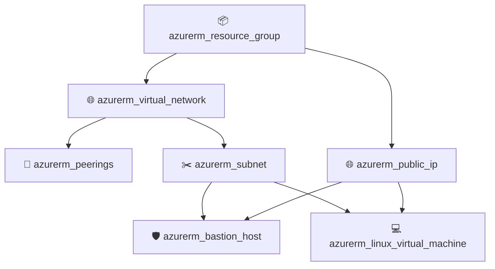

# 🚀 Terraform Monolithic Landing Zone (Azure) 🏗️

Welcome to the **Terraform Monolithic Landing Zone** repository! This project implements a data-driven, modular Azure Landing Zone architecture managed through a single monolithic environment entrypoint. 

It provides an end-to-end, automated deployment of foundational Azure cloud infrastructure—including Resource Groups, Hub-and-Spoke Virtual Networks, Subnets, VNet Peerings, Public IPs, Azure Bastion Hosts, and Multi-Tier Linux Workload VMs.

---

## 📌 Architecture Overview

The **Monolithic Landing Zone** pattern leverages reusable, parameterised **child modules** driven dynamically by `for_each` maps in environment configuration files (`terraform.tfvars`). 

### 🌐 Network Topology (Hub & Spoke)

```
                         +-----------------------------------+
                         |         Azure Cloud               |
                         +-----------------------------------+
                                           |
                    +----------------------+----------------------+
                    |                                             |
         +--------------------+                        +--------------------+
         |   Hub VNet         |                        |   Spoke VNet       |
         |   (10.1.0.0/16)    | <====================> |   (10.0.0.0/16)    |
         +--------------------+    Bi-Directional      +--------------------+
         | - AzureBastionSubnet|       Peering          | - frontend-snet    |
         | - Azure Bastion Host|                        | - backend-snet     |
         | - Static Public IP  |                        | - database-snet    |
         +--------------------+                        +--------------------+
                                                         |        |        |
                                                         v        v        v
                                                      [VM: FE] [VM: BE] [VM: DB]
```

### ⚡ Infrastructure Provisioning Flow



---

## 📁 Repository Directory Structure 📂

```
Terraform-Monolithic-Landing_Zone/
├── 📁 child-module/                       # Reusable infrastructure child modules
│   ├── 📁 azurerm_bastion_host/          # Provision Azure Bastion Host with IP configuration
│   ├── 📁 azurerm_linux_virtual_machine/  # Provision Linux VMs & Network Interfaces (NIC)
│   ├── 📁 azurerm_peerings/               # Establish bi-directional VNet peerings
│   ├── 📁 azurerm_public_ip/              # Provision Static/Dynamic Azure Public IPs
│   ├── 📁 azurerm_resource_group/         # Create Azure Resource Groups
│   ├── 📁 azurerm_subnet/                 # Define Subnets inside Virtual Networks
│   └── 📁 azurerm_virtual_network/        # Provision Virtual Networks (VNets)
│
├── 📁 environmets/                        # Environment configurations
│   └── 📁 preprod/                        # Pre-production landing zone deployment
│       ├── 📄 main.tf                     # Monolithic root orchestration module
│       ├── 📄 provider.tf                 # AzureRM provider & backend setup
│       ├── 📄 variable.tf                 # Input variable schema definitions
│       └── 📄 terraform.tfvars            # Resource definitions (maps)
│
├── 📄 .gitignore                          # Git ignore rules for Terraform state & binaries
└── 📄 README.md                           # Repository documentation
```

---

## 🧩 Child Modules Reference 🔧

All child modules use dynamic map variables (`for_each`) to provision resources flexibly without duplicating Terraform code blocks.

| Module | Source Directory | Resource Created | Description |
| :--- | :--- | :--- | :--- |
| 📦 **Resource Group** | `child-module/azurerm_resource_group` | `azurerm_resource_group` | Creates target Azure Resource Groups across regions. |
| 🌐 **Virtual Network** | `child-module/azurerm_virtual_network` | `azurerm_virtual_network` | Provisions VNets with configurable address spaces. |
| ✂️ **Subnet** | `child-module/azurerm_subnet` | `azurerm_subnet` | Creates subnets within existing VNets. |
| 🔗 **VNet Peerings** | `child-module/azurerm_peerings` | `azurerm_virtual_network_peering` | Establishes VNet-to-VNet peering connections. |
| 🌐 **Public IP** | `child-module/azurerm_public_ip` | `azurerm_public_ip` | Allocates public IPv4 addresses (Static/Dynamic). |
| 🛡️ **Azure Bastion** | `child-module/azurerm_bastion_host` | `azurerm_bastion_host` | Deploys secure RDP/SSH Azure Bastion Host. |
| 💻 **Linux VMs** | `child-module/azurerm_linux_virtual_machine` | `azurerm_linux_virtual_machine`<br>`azurerm_network_interface` | Deploys Ubuntu Linux VMs with NICs & OS Disks. |

---

## ⚙️ Environment Configuration 📝

Environment infrastructure is defined completely in data maps in `environmets/preprod/terraform.tfvars`.

### 📋 Configured Resources in `preprod`:

* 📦 **Resource Group**: `Ahir` (Location: `East Asia`)
* 🌐 **VNets**:
  * `hub-vnet` (`10.1.0.0/16`)
  * `spoke-vnet` (`10.0.0.0/16`)
* ✂️ **Subnets**:
  * `AzureBastionSubnet` (`10.1.0.0/24` on `hub-vnet`)
  * `frontend-snet` (`10.0.0.0/24` on `spoke-vnet`)
  * `backend-snet` (`10.0.1.0/24` on `spoke-vnet`)
  * `database-snet` (`10.0.2.0/24` on `spoke-vnet`)
* 🔗 **Peerings**: `peer-hub-to-spoke` & `peer-spoke-to-hub`
* 🛡️ **Bastion**: `azure_bastion` connected to `AzureBastionSubnet` & Static Public IP `Pip-Bastion`
* 💻 **Virtual Machines** (Ubuntu 24.04 LTS):
  * `frontend_VM` (Tier: Frontend Subnet)
  * `Backend_VM` (Tier: Backend Subnet)
  * `Database_VM` (Tier: Database Subnet)

---

## 🛠️ Prerequisites & Requirements 📋

Before deploying, ensure you have:

* 🔨 **Terraform CLI**: Version `>= 1.0` installed.
* ☁️ **Azure CLI**: Installed and logged in (`az login`).
* 🔑 **Azure Subscription**: Active subscription with `Contributor` or `Owner` permissions.
* 📦 **AzureRM Provider**: Version `4.79.0` (configured in `provider.tf`).

---

## 🚀 Step-by-Step Deployment Guide 🏁

### 1️⃣ Clone the Repository

```bash
git clone https://github.com/AhirChandan/Terraform-Monolithic-Landing_Zone.git
cd Terraform-Monolithic-Landing_Zone
```

### 2️⃣ Navigate to Target Environment

```bash
cd environmets/preprod
```

### 3️⃣ Authenticate to Azure

```bash
az login
az account set --subscription "<YOUR_AZURE_SUBSCRIPTION_ID>"
```

### 4️⃣ Initialize Terraform

Initializes the working directory and downloads the required HashiCorp `azurerm` provider plugin:

```bash
terraform init
```

### 5️⃣ Generate Execution Plan

Inspect the proposed execution plan to verify resources to be created:

```bash
terraform plan
```

### 6️⃣ Apply Configuration

Provision the entire Azure Monolithic Landing Zone:

```bash
terraform apply -auto-approve
```

---

## 🔒 Security & State Management Best Practices 🛡️

* 🗄️ **Remote State Storage**:
  `provider.tf` includes a commented template for Azure Blob Storage backend. In production, uncomment and configure remote backend storage to store `terraform.tfstate` securely with state locking:
  ```hcl
  backend "azurerm" {
    resource_group_name  = "rg-terraform-state"
    storage_account_name = "sttfstateacct"
    container_name       = "tfstate"
    key                  = "preprod.landingzone.tfstate"
  }
  ```
* 🔑 **Secrets Management**:
  Avoid committing sensitive credentials (such as VM `admin_password`) directly into `terraform.tfvars`. Use **Azure Key Vault**, environment variables (`TF_VAR_VM-value`), or command-line variable input for sensitive values in production pipelines.

---

## 🧹 Destroying Resources 🗑️

To clean up and tear down all deployed resources in the environment:

```bash
cd environmets/preprod
terraform destroy -auto-approve
```

---

## 📜 License & Author 👨‍💻

* **Author**: Chandan Ahir ([@AhirChandan](https://github.com/AhirChandan))
* **Repository**: [Terraform-Monolithic-Landing_Zone](https://github.com/AhirChandan/Terraform-Monolithic-Landing_Zone)

---
*Happy Terraforming! 🚀✨*
